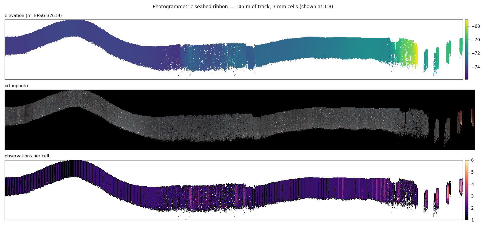
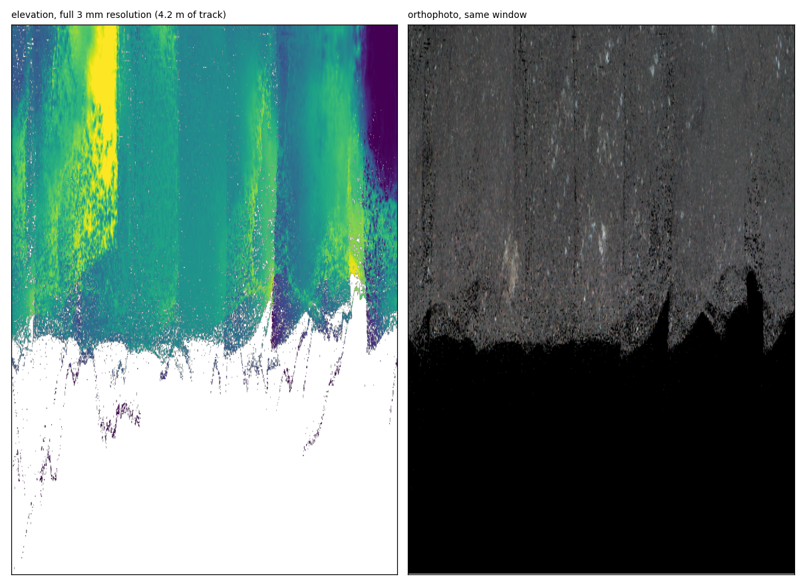
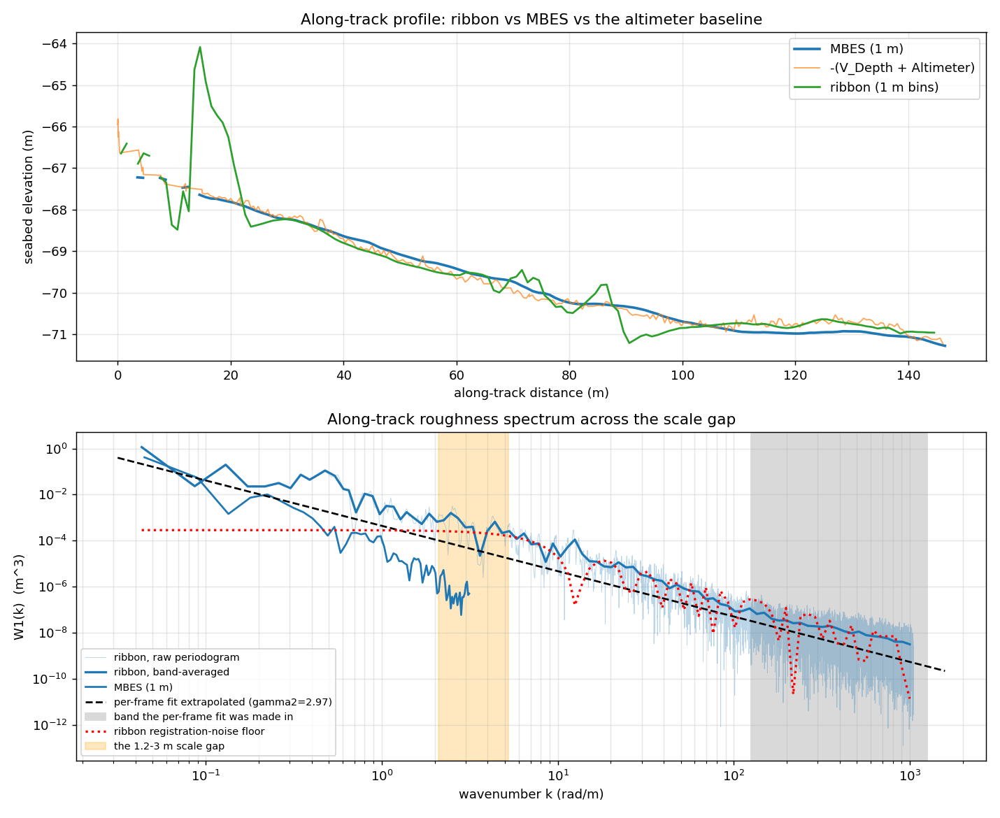

# A millimetre-resolution photogrammetric seabed ribbon

**Georeferencing validation, and a first look into the roughness scale gap.**
HabCam line 6663–6958, cruise HRS1508 (2015-06-19), Georges Bank.

| | |
|---|---|
| **Status** | Results record — the authoritative account of what was measured |
| **Date of run** | 2026-09-18 |
| **Data** | 296 stereo frames, 145 m of track, EPSG:32619 |
| **Code** | `gt/ribbon.py`, `scripts/build_ribbon.py` (merged in [#36](https://github.com/epifanio/groundtruther/pull/36)) |
| **Method notes** | [photogrammetric_ribbon.md](photogrammetric_ribbon.md) |
| **Plan and progress log** | `PLANNING/photogrammetric-ribbon.md` |

> This document is the durable record of the measurements. The method note next
> to it explains *how* to build a ribbon; this one states *what was found*, with
> the numbers, the uncertainties, and the questions that stayed open.

---

## 1 · Summary

A continuous, georeferenced elevation ribbon of the seabed was built by
compositing 290 per-frame stereo micro-DEMs along a single HabCam line: **145 m
of track at 3 mm resolution**, in the survey CRS, with a co-registered
orthophoto.

Four findings, in descending order of confidence.

1. **The georeferencing heading fix ([#31](https://github.com/epifanio/groundtruther/issues/31))
   is correct.** Of 250 independently registered frame pairs, **100 % support
   `heading_deg = bearing + 180` and 0 % support the previous
   `heading_deg = bearing`** (median residuals +3.9° and −175.3° respectively).
   The residual also bounds single-frame heading accuracy at **≈ 4°**.
2. **Registering frames on imagery beats navigation by 8.7×.** Where a pair
   linked, the two frames agree to **13.7 mm** where they overlap; where the link
   failed and navigation bridged the gap, they disagree by **119.3 mm**.
3. **The ribbon does not improve absolute vertical accuracy.** Against the 1 m
   multibeam it achieves 0.185 m median |dz| where the vehicle's own
   `-(V_Depth + Altimeter)` achieves 0.115 m on the same strip. The ribbon's
   contribution is millimetre *texture*, not decimetre *placement*.
4. **The roughness power law appears to under-predict at metre scales, but the
   measurement is not conclusive.** The ribbon carries **9.45× (+9.8 dB)** more
   power in the 1.2–3 m band than the per-frame γ₂ law predicts — yet only
   **1.74×** above the ribbon's own registration-noise floor, with a fitted
   exponent of 2.29 ± 1.56. Settling it requires per-frame vertical placement of
   **≈ 6 mm**, against the 60 mm achieved.

---

## 2 · Objective

γ₂, the spectral exponent used as the acoustic roughness input, is fitted inside a
single stereo frame — over wavelengths of roughly 3 mm to 1.2 m — and is then used
to interpret backscatter whose footprint is metres across. The multibeam grid
resolves nothing below about 2–3 m. Between those lies a band that no existing
product measures:

| product | wavelengths supported |
|---|---|
| per-frame micro-DEM | ~3 mm … 1.2 m |
| MBES bathymetry (`bathy_2015.tif`, 1 m grid) | ≥ 2–3 m |
| **the gap** | **1.2 m … 3 m** |

A ribbon 145 m long at 3 mm spans 3 mm to 145 m with a single sensor, and can
therefore test whether the per-frame power law extrapolates across that gap.

The exercise had a second, prior purpose: to test whether the **image orientation
used for georeferencing** is correct. That question is answered first, because
every other result depends on it.

---

## 3 · Data and site

- **Imagery.** 73 710 archived stereo frames (`*_orig.png`, 2720 × 1024,
  side-by-side; the left half is the delivered JPEG). Line 6663–6958 was selected:
  296 contiguous frames, 172 m of navigated track, 100 % on the multibeam grid.
- **Navigation.** The calibrated USBL seafloor fix (`Xutm + dx`, `Yutm + dy`).
  Piecewise-constant: median per-frame step **92 mm**, against the **491 mm** the
  imagery shows the vehicle actually advancing.
- **Reference bathymetry.** `bathy_2015.tif`, 3456 × 679 at 1.00 m, EPSG:32619,
  −81.96 … −55.05 m. Relief under this line: 4.21 m.
- **Micro-DEMs.** Computed frame by frame by the stereo-roughness service
  (RAFT-Stereo, GPU), returning real-height grids, co-registered orthophotos, a
  radial roughness spectrum, and a rotated affine geotransform per frame.

### Line selection is governed by texture, not relief

Consecutive frames can only be registered where the seabed carries texture, and on
this survey texture and relief are **uncorrelated**. Measured by ORB + RANSAC on
30 consecutive pairs per run, sampled in five blocks spread across each run:

| line (rows) | relief | link rate | median inliers |
|---|---|---|---|
| 55651–55954 | **5.80 m** (most in survey) | 57 % | 22 |
| 9081–9383 | 5.42 m | 20 % | 10 |
| 47465–47653 | 4.04 m | **0 %** | 9 |
| 62911–63201 | 3.75 m | **0 %** | 10 |
| **6663–6958 (selected)** | 4.21 m | **77 %** | **239** |
| 43537–43851 | 3.67 m | 87 % | 85 |

Two lines carrying metres of relief register on **none** of the pairs sampled —
they are featureless mud. Selecting on relief would have chosen one of them.

The search was exhaustive without being complete: runs were scored in descending
relief and the scan **terminated with a proof** after 13 of 161 candidates, once
the leader's score (`link_rate × relief × on_dem_fraction`, with `link_rate ≤ 1`)
exceeded the relief of every remaining run.

---

## 4 · Methods

1. **Registration (imagery only, no service).** ORB + RANSAC between consecutive
   left images. Four departures from a default configuration were necessary — a
   plain ORB + RANSAC scores **0 %** on every line tested: no radiometric
   preprocessing (flat-fielding and CLAHE both *reduce* the inlier count on
   imagery whose mean grey level is ~21/255), a permissive Lowe ratio (0.95),
   detection masked to the band that can overlap, and a displacement prefilter
   before RANSAC with a physical gate after it. The gate is essential: RANSAC
   otherwise returns confident 15–25-inlier consensuses on entirely wrong
   transforms.
2. **Pose chain.** Accepted links are integrated into a track, unlinked pairs are
   bridged by navigation, and the result is rubber-sheeted back onto the USBL over
   a 51-frame window so that *absolute* placement remains navigational while
   *relative* geometry comes from the imagery. The anchor smoother is Gaussian and
   trend-preserving; a boxcar leaks the navigation's 6-frame sawtooth back in, and
   a trend-blind smoother shortens the track by several percent.
3. **Acquisition.** One service call per frame, with the raw JSON cached to disk
   *before* any decoding. 296 calls, 0 failures, 312 MB.
4. **Compositing.** Each frame arrives on its own rotated affine at its own cell
   size (2, 3, 4 and 5 mm all occur), so compositing is a resample, not a paste.
   The target grid is aligned to the track rather than north-up: 145 m at 3 mm is
   ~57 000 × 400 cells track-aligned against ~41 000 × 41 000 in a north-up box —
   seventy times the cells for the same data. Overlaps are feathered by distance
   to frame edge, and a per-cell observation count is retained as a QA band.
5. **Vertical levelling.** Per-frame vertical offsets are solved from the overlap
   medians by robust iteratively-reweighted least squares over lag-1 and lag-2
   pairs (so the chain closes loops), retaining only the high-frequency component
   so that the vertical datum remains the vehicle's.
6. **Analysis.** The along-track profile is the cross-track median of each row.
   Spectra are computed as two-sided densities in rad/m, **band-averaged in
   log-spaced bins before fitting**, and reported with a standard error on the
   exponent.

---

## 5 · Results

### 5.1 The founding question: is the georeferencing orientation correct?

GroundTruther formerly sent `heading_deg = bearing`. But `bearing` is the compass
direction of the layback offset — ship to towed body — and therefore points
**astern**; every georeferenced roughness raster produced before the fix is
rotated 180°. Three distinct questions hide inside "orientation", and they have
three different answers.

#### (a) The 180° — settled

Each registered pair states which way the platform moved *in its own body frame*,
directly from the pixels. Rotating that into the world requires a heading, and the
navigation offers two candidates; only one can reproduce the course over ground,
which is taken independently from the USBL positions over a ±15-frame baseline
(long enough that the piecewise-constant navigation has demonstrably moved).

| hypothesis | median residual | IQR | within 30° |
|---|---|---|---|
| H1 · `heading = bearing` (former behaviour) | **−175.3°** | −176.8 … −173.3 | **0.0 %** |
| H2 · `heading = bearing + 180` (the #31 fix) | **+3.9°** | +2.2 … +5.6 | **100.0 %** |

n = 250 registered pairs. **Every pair supports H2; none supports H1.** This
replicates an earlier determination that rested on 59 template matches, using a
more sensitive matcher and four times the sample. The **+3.9°** residual combines
camera yaw, USBL noise and cross-track drift, and is therefore also the useful
figure: the **accuracy of a single frame's heading is ≈ 4°** (previously quoted as
~5°).

The test reproduces offline from `links.csv` and `poses.csv` alone — no service,
no imagery.

#### (b) Does the service apply what it is sent? — yes, exactly

The heading read back out of the returned geotransform, minus the heading sent, is
**+0.00°** (median over all 296 frames). The contract round-trips exactly, and
this service does not exhibit
[stereo-roughness#1](https://github.com/epifanio/stereo-roughness/issues/1) on the
client-supplied `geo` path.

#### (c) Handedness — the contract holds; the physical mount remains untested

A mirror is a reflection, not a rotation, so nothing above constrains it. Measured
directly on the returned grids, the `+col` axis lies at **+90.00°** from the
`−row` axis on all 290 usable frames: image-right is starboard *in the grid*,
exactly as the mount contract specifies, with no mirror applied.

**This does not establish that the physical camera's right side is starboard.** A
mirror applied consistently to every frame leaves the seams, the chain closure and
the multibeam comparison all unchanged, because adjacent frames are reflected
identically. The ribbon is ~1.2 m across and the multibeam grid is 1 m, so neither
resolves cross-track structure finely enough to detect it. The H1/H2 residual
cannot separate it either: reversing handedness would move that residual from
+3.9° to approximately −3.7°, and the true camera yaw is unknown, leaving both
equally consistent. **Resolving this requires a target of known handedness.**

#### (d) What the ribbon cannot test

It is tempting to cite the 13.7 mm seams as proof that the orientation is correct.
They are not, and this was tested rather than assumed. Recomposing the entire
ribbon with the pre-#31 heading — positions, chain, levelling and blending held
identical, so that the only variable is the per-frame rotation — moves the seam
error from **67.1 mm to 85.6 mm**. The direction is right but the degradation is
only 28 %, because rotating a frame about its own centre preserves its mean
elevation and this seabed is smooth at the 1.2 m frame scale. **The ribbon is a
weak instrument for the orientation question; the H1/H2 test in (a) is the strong
one.** Similarly, the ribbon's +0.924 correlation with the multibeam falls to
−0.789 when reversed, but that establishes only that the strip is not globally
backwards, which was never in question.

### 5.2 Registration performance

| measurement | value |
|---|---|
| Frame-to-frame link rate | **89.8 %** (265 of 295 pairs) |
| Median inliers, linked pairs | 309 |
| Longest unbroken registered run | **119 pairs** (mean 48) |
| Rejections | 28 too few inliers, 1 rotation, 1 advance out of band |
| Navigation step per frame | median 92 mm (13–3538 mm) |
| Chain step per frame | median **491 mm** |
| Frames placed from pixels / navigation | 265 / 31 |

The planning expectation was a hybrid of ~2.4-frame registered fragments bridged
by navigation. The outcome is the reverse: a near-continuous photogrammetric chain
with 31 navigational gaps.

Two independent consistency checks on the geometry, either of which a heading or
body-axis sign error would break: the chain's own end-to-end azimuth is **273.1°**
against the corrected navigational heading of **273.2°**; and calibrating the focal
length against the navigation's end-to-end displacement over 50-frame windows
returns **2507 px** against the nominal rectified-left value of 2480.28 px — a
ratio of **1.011**.

### 5.3 Product quality



*The complete ribbon at 1:8. The sinuous form is the vehicle's own cross-track
wander. Coverage thins over the last ~20 m, where the strip breaks into isolated
patches.*



*4.2 m at the full 3 mm resolution. Individual scallops and shell debris resolve in
the orthophoto. The vertical banding in the elevation panel reads as frame seams
but is not: along-track row medians step by 9.9 mm, consistent with the measured
seam error — the banding is the real seabed gradient rendered across a narrow
colour range.*

| measurement | value |
|---|---|
| Frames usable | 290 of 296 |
| `quality != "ok"` | **2.0 %** (6 frames, all `insufficient_coverage`) |
| Service `altitude_mm` vs metadata `Altimeter` | median **37 mm** |
| `valid_fraction` | median 0.837 (min 0.268) |
| Per-frame γ₂ | median 2.97 (IQR 2.66–3.15) |
| Output grid | 1256 × 48339 at 3 mm, azimuth 273.1°, 18.3 M valid cells |
| Coverage | 30.2 % of grid = 165 m² |
| Observations per covered cell | median 2, maximum 6 |

#### Seam error, before and after vertical levelling

The dominant vertical error proved to be instrumental rather than photogrammetric:
`V_Depth` is quantised to 10 mm and steps frame to frame with **σ = 82 mm**, which
accounts for essentially the whole measured per-frame vertical scatter. The
micro-DEMs measure their own relative height far better than this wherever they
overlap.

| seam error (elevation difference where two frames overlap) | before | after |
|---|---|---|
| pixel-linked pairs (n = 356) | 62.0 mm | **13.7 mm** |
| navigation-bridged pairs (n = 38) | 235.5 mm | **119.3 mm** |
| all pairs (n = 394) | 67.1 mm | **18.5 mm** |
| per-frame vertical σ | 139.9 mm (66.2 robust) | 60.4 mm (21.1 robust) |

**Pixel-linked seams are 8.7× better than navigation-bridged ones.** This is the
clearest single justification for registering the frames at all.

Levelling is not without cost: it degraded agreement with the multibeam at 1 m
bins (0.147 → 0.185 m median |dz|) while improving seams 4.5-fold. The likely
cause is that some of the larger corrections — the 95th percentile correction is
1.26 m, rescuing frames whose micro-DEM is badly wrong — over-fit poor overlaps
rather than repairing poor frames. Levelling is enabled by default because this
product exists for millimetre-to-metre scales; `--no-level` produces the
unlevelled version.

### 5.4 Vertical accuracy against the multibeam

| source | correlation | median abs dz |
|---|---|---|
| `-(V_Depth + Altimeter)`, this line | +0.988 | **0.115 m** |
| the ribbon, 1 m bins | +0.924 | **0.185 m** |
| `-(V_Depth + Altimeter)`, survey-wide (n ≈ 78 000) | +0.662 | 0.27 m |

**The ribbon does not beat the altimeter baseline.** This is a legitimate outcome:
the ribbon's value is millimetre texture, not decimetre placement. The bar on this
particular line is unusually high — the altimeter matches the multibeam more than
twice as well here as it does survey-wide.

The disagreement is not spatially concentrated: the first 85 % of the line sits at
0.189 m and the fragmented final 15 % at 0.171 m. The poorest stretch is 87–101 m
along track (0.460 m), with a single 3.56 m outlier near 20 m.

### 5.5 The along-track roughness spectrum



*Top: the along-track profile, three ways. Bottom: spectra on log-log axes. The
shaded band is the 1.2–3 m scale gap; the dotted line is the ribbon's own
registration-noise floor.*

A two-dimensional isotropic power law `W₂(K) = w₂(K/k_ref)^(−γ₂)` implies a
one-dimensional profile spectrum with **no free parameter**:

```
W₁(k) = w₂ · k_ref^γ₂ · k^(1−γ₂) · √π · Γ((γ₂−1)/2) / Γ(γ₂/2)
```

so `γ₁ = γ₂ − 1` and the amplitude follows. The test is whether the ribbon's own
spectrum lands on that line inside the gap.

| quantity | value |
|---|---|
| Per-frame γ₂ (median, n = 290, fitted 125–1257 rad/m) | 2.97 |
| γ₁ it predicts in the gap band | 1.97 |
| γ₁ the ribbon measures (k = 2.09–5.24 rad/m) | **2.29 ± 1.56** |
| Measured power ÷ predicted | **9.45× (+9.8 dB)** |
| Measured power ÷ registration-noise floor | **1.74×** (14× at the robust σ) |
| Multibeam γ₁ over 2–40 m | 3.60 ± 0.16 (γ₂ ≈ 4.60) |

**Interpretation.** The ribbon carries substantially more power at metre scales
than the per-frame law predicts, which is the physically interesting direction: if
real, a γ₂ extrapolated to an acoustic footprint would *under*-predict roughness.
But the result is **suggestive, not conclusive**, for two quantified reasons.

- The fitted exponent's ±1.56 uncertainty spans every physically plausible value.
  One third of a decade is not enough bandwidth to fit an exponent.
- The amplitude excess is only **1.74×** above the ribbon's own registration-noise
  floor. Independent per-frame vertical errors of standard deviation σ, held
  constant across each frame and changing every 0.49 m, produce a nearly flat
  spectral density across precisely this band:
  `W₁,noise(k) = σ²Δs/2π · sinc²(kΔs/2)`. At the measured σ = 60 mm that floor sits
  just below the measurement.

The supporting evidence points the same way without settling it. The multibeam's
own along-track spectrum is far steeper than the frames' (γ₂ ≈ 4.60 against 2.97),
and the ribbon's gap-band value of 3.29 lies between them — the form a gradual
break would take. But a 1 m grid is smoothed by its own gridding in exactly that
band, so on its own it demonstrates nothing.

**Requirement to settle it.** To place the noise floor an order of magnitude below
the predicted signal, per-frame vertical placement must reach **≈ 6 mm**, against
the **60 mm** achieved — a tenfold improvement, and a vertical bundle-adjustment
problem.

---

## 6 · Limitations

- **Cross-track mosaicking is impossible from a single line.** There is no
  cross-track overlap; the product is a ~1.2 m wide ribbon and no processing makes
  it a surface.
- **Physical mount handedness is untested** (§5.1c).
- **One line, one site.** Every figure here is from lines of this cruise on Georges
  Bank; the texture statistics in particular are unlikely to transfer.
- **Link rates are not comparable with earlier work** using a plain ORB + RANSAC
  over each run's first 150 frames.
- **Six frames returned `insufficient_coverage`** and are absent from the
  composite; the observation-count band marks where.
- **The vertical datum is the vehicle's.** Levelling deliberately retains only
  high-frequency corrections, so any slow drift in `V_Depth` propagates into the
  ribbon.

---

## 7 · Conclusions

1. The heading correction of issue #31 is **verified** on 250 independently
   registered frame pairs, with unanimous support and none for the prior
   behaviour. Single-frame heading accuracy is **≈ 4°**.
2. Image-based registration of consecutive frames outperforms navigational
   placement by **8.7×** in seam agreement, and is achievable on **89.8 %** of
   consecutive pairs on a line chosen for texture.
3. A millimetre-resolution georeferenced seabed ribbon spanning 3 mm to 145 m is
   **feasible** from existing HabCam stereo and existing navigation, at a cost of
   ~300 service calls per line.
4. The ribbon **does not improve absolute vertical accuracy** over the vehicle's
   own instruments.
5. The per-frame roughness power law **may under-predict** at metre scales by
   roughly an order of magnitude, but the present measurement cannot separate that
   from its own registration noise. A ~6 mm per-frame vertical solution would.

---

## 8 · Reproduction

Software: QGIS 4 / Qt6 plugin tree, Python 3.14, OpenCV 4.13, GDAL 3.12,
NumPy 2.3, SciPy 1.17. Roughness service: stereo-roughness (RAFT-Stereo) on a
local GPU, port 7871, no authentication.

```bash
docker start stereo-roughness

scripts/build_ribbon.py inventory
scripts/build_ribbon.py scan
scripts/build_ribbon.py chain     --start 6663 --n 296
scripts/build_ribbon.py fetch     --start 6663 --n 296 \
    --direct-url http://127.0.0.1:7871/roughness
scripts/build_ribbon.py inspect   --start 6663 --n 296
scripts/build_ribbon.py composite
scripts/build_ribbon.py analyse
```

Throughput was ~13 s per frame with the GPU shared with another container; the
full line took 73 minutes. Every response is cached before decoding, so any
rebuild after the first needs no service.

With no service at all, `scripts/build_ribbon.py simulate` fabricates a cache from
a seabed of known spectrum. This is how the compositing and analysis were
validated: a planted γ₂ of 3.00 is recovered as **γ₁ = 2.35 ± 0.41** with an
amplitude ratio of **1.02×**, and a seam floor of 9.0 mm (the resampling and
blending floor, since the simulation carries no registration error).

**Outputs.** `ribbon_dem.tif` (1-band Float32, NaN nodata), `ribbon_ortho.tif`
(3-band RGB), `ribbon_count.tif` (observations per cell), `ribbon_track.gpkg`
(chain track plus all 296 frame positions carrying a `source` field of `pixel` or
`nav`), and `ribbon.qgs`, a QGIS project with every layer stacked over the
multibeam. These are written to the working directory and are **not** in version
control — about 550 MB.

Note that QGIS warps the track-aligned grid to north-up on display and reports a
larger bounding box with an added alpha band. This is expected; the file and its
georeference are correct.

---

## 9 · Provenance

Executed from `PLANNING/photogrammetric-ribbon.md` on branch
`feat/photogrammetric-ribbon`; code merged in
[#36](https://github.com/epifanio/groundtruther/pull/36). Test suite at the time
of the run: 411 passed, 7 skipped, including 80 unit tests for the ribbon geometry
— all synthetic, no network.

Related records: [photogrammetric_ribbon.md](photogrammetric_ribbon.md) (method),
`PLANNING/photogrammetric-ribbon.md` (plan and progress log),
[#31](https://github.com/epifanio/groundtruther/issues/31) (the heading defect),
[stereo-roughness#1](https://github.com/epifanio/stereo-roughness/issues/1) (the
same defect, service side, still open for mode-A mosaics).
