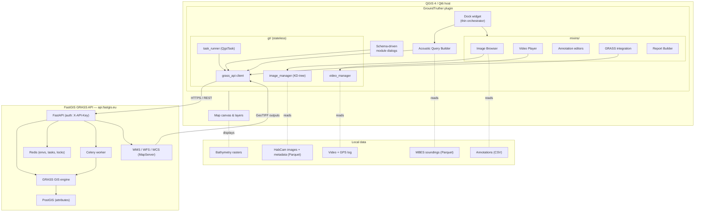
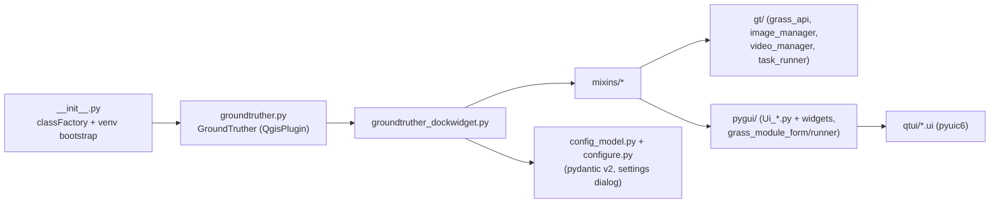

# Architecture

GroundTruther is a QGIS 4 / Qt6 plugin (Python) that orchestrates local data
browsing and annotation in the QGIS canvas, and delegates heavy geospatial
analysis to a remote GRASS service via the FastGIS API.

## Components & data flow

**Reading the diagram:** the plugin runs entirely inside QGIS. UI logic lives in
focused **mixins** combined into one dock widget; reusable, Qt-free helpers live in
**`gt/`**. All acoustic/terrain work is sent over HTTPS to the **FastGIS GRASS
API**, which executes GRASS modules (synchronously or via a Celery worker),
stores state in Redis/PostGIS, and serves raster results back as GeoTIFF (WCS).

## Module map (in-repo)

## Key dependencies

| Area | Packages |
|---|---|
| Data handling | numpy, pandas, pyarrow |
| Imagery / CV | scikit-image, scipy, opencv-python-headless |
| Viewer / plots | pyqtgraph, PyOpenGL, matplotlib, plotnine |
| Geospatial | pyproj, simplekml, geojson, requests |
| Acceleration | numba (optional GPU: cudf/cuspatial) |
| Config / templating | PyYAML, pydantic, starlette, Jinja2 |
| Host-provided (do **not** pip-install) | qgis, gdal/osgeo, PyQt6 |

## Design notes

- **Thin dock + mixins:** the dock widget is a high-level orchestrator; each
  feature area is an independently readable mixin.
- **Stateless `gt/` core:** networking, indexing and task orchestration are
  Qt-free and unit-testable.
- **Environment-scoped, authenticated API:** every GRASS call carries an API key
  and targets a server-side environment (location/mapset) owned by the user.
- **Schema-driven UIs:** GRASS module dialogs are generated from each module's
  interface description, so the toolset extends to new modules with no UI code.
- **Async by default for compute:** long-running modules run as background tasks
  with progress/cancel, keeping QGIS responsive.

For the developer/agent-oriented internals (conventions, gotchas, testing without
the GUI), see `CLAUDE.md` and `docs/grass_fastgis.md` in the repository.
