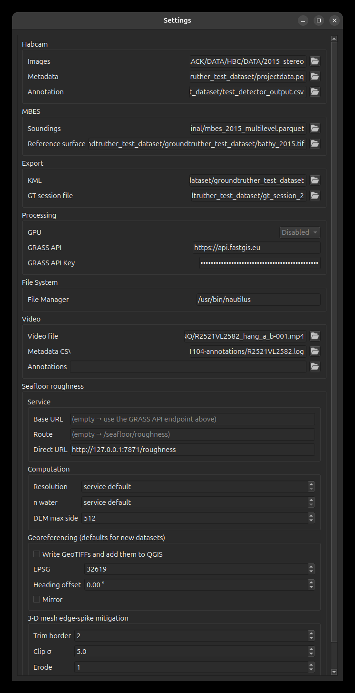

# Configuration

Everything GroundTruther needs to know about *your* data and *your* services lives
in a single YAML file, `config/config.yaml`. You normally never edit it by hand —
the **Settings** dialog writes it for you — but knowing what it is and where it
lives makes every "why can't the plugin see my data?" question answerable.

- **[Settings reference](settings-reference.md)** — all 27 keys: type, default,
  what each one does, what happens when it is wrong.
- **[Validation & troubleshooting](validation.md)** — how GroundTruther grades the
  file, which two keys are fatal, and how to read the messages it logs.

## Where the file lives

`config.yaml` sits **inside the installed plugin folder**, next to the code:

=== "Linux"
    ```
    ~/.local/share/QGIS/QGIS4/profiles/default/python/plugins/groundtruther/config/config.yaml
    ```

=== "macOS"
    ```
    ~/Library/Application Support/QGIS/QGIS4/profiles/default/python/plugins/groundtruther/config/config.yaml
    ```

=== "Windows"
    ```
    %APPDATA%\QGIS\QGIS4\profiles\default\python\plugins\groundtruther\config\config.yaml
    ```

If you installed from source with a symlink, that path resolves back into your
checkout — the file is `config/config.yaml` in the repository.

!!! warning "It is per-install, not per-project"
    The configuration is **not** stored in your `.qgz` QGIS project and does not
    travel with it. One QGIS profile has one GroundTruther configuration, shared
    by every project you open. Switching survey datasets means changing the
    settings (or keeping a second QGIS profile).

    The one exception is the roughness **Georef** calibration, which is saved
    per dataset in `QgsSettings` — see
    [Seafloor Roughness](../tools/seafloor-roughness.md#georeferencing-georef-tab).

## It contains a secret

`Processing.grass_api_key` is your FastGIS API key (`fgk_…`). Anyone holding the
file can use your quota and your server-side environments.

- `config/config.yaml` is **git-ignored** in the repository, so it is never
  committed. The template that *is* committed is
  [`config/config.example.yaml`](https://github.com/epifanio/groundtruther/blob/master/config/config.example.yaml).
- Do not paste the file into issues, chats or logs without blanking the key.
- Do not put it on a shared drive that other accounts can read.

## Opening the Settings dialog

From the GroundTruther toolbar, click the **wizard** icon. The dialog reads the
current file, shows every key, and writes it back when you press **Save
settings**.

<figure markdown>
  { width="560" }
  <figcaption>The Settings dialog — one group box per config section, covering all
  27 keys. The GRASS API key is masked; the path fields elide from the left, so a
  long path shows its tail.</figcaption>
</figure>

The dialog is grouped the same way the YAML is: **Filesystem**, **HabCam**,
**Mbes**, **Export**, **Processing**, **Video**, **Seafloor roughness** and the
GroundTruther session file. Every key in the file has a widget, so nothing has to
be hand-edited.

Saving takes effect immediately — the image browser reloads its metadata, the
query builder re-reads its data sources, and cloud features re-evaluate whether
they are reachable. No plugin restart, no QGIS restart.

## Starting from scratch

Copy the shipped template and edit the paths:

```bash
cd <plugin folder>
cp config/config.example.yaml config/config.yaml
```

Then open **Settings** and use the `…` buttons to point each entry at your data.
Only two entries are mandatory: the HabCam **image directory** and the HabCam
**metadata file**. Everything else can stay empty — each unset key simply turns
off the one feature that needs it.

## How the file is written

The Settings dialog **merges** its values into the document already on disk; it
does not regenerate the file from a template. Two consequences worth knowing:

1. **A section the dialog does not know about is preserved**, not deleted. If a
   future version adds a section and you save from an older dialog, your section
   survives.
2. **Comments are not preserved, but the file's shape is.** It is re-serialised
   with `yaml.safe_dump`, keeping the leading `---`, four-space indentation and
   the original key order — so a save through the dialog is not a gratuitous
   reformat of every line. Any comments you added by hand are still lost, since
   PyYAML does not round-trip them. Keep notes elsewhere.

Hand-editing the YAML is perfectly fine — GroundTruther re-reads the file every
time the dialog opens and every time the plugin loads. Values are read
defensively: a key that is missing, `null`, or holds the wrong type degrades to
its default instead of raising.

## A worked example

```yaml
---
Filesystem:
    filemanager: /usr/bin/nautilus
HabCam:
    imagepath: /data/hrs1508/imgs_jpg
    imagemetadata: /data/hrs1508/projectdata.pq
    imageannotation: /data/hrs1508/detector_output.csv
Mbes:
    soundings: /data/hrs1508/mbes_2015_multilevel.parquet
    reference_surface: /data/hrs1508/bathy_2015.tif
Export:
    kmldir: /data/hrs1508/kml_output
Processing:
    gpu_avaibility: false
    grass_api_endpoint: https://api.fastgis.eu
    grass_api_key: fgk_...
Video:
    videofile: /data/hrs1508/dive.mp4
    videometadata: /data/hrs1508/dive_survey.csv
    videoannotation: null
Session:
    groundtruther_project: /data/hrs1508/gt_session.json
Roughness:
    georeference: true
    epsg: 32619
```

The data those paths point at is described in the
**[Data model](../data-model/image-metadata.md)** section.
