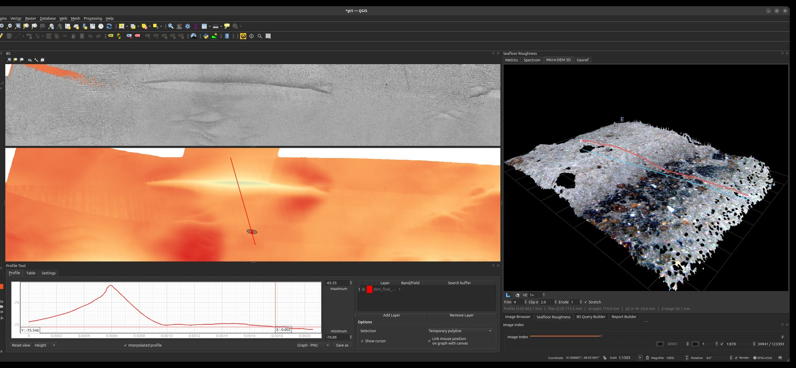

# GroundTruther

**A QGIS plugin for seafloor characterization** — explore and analyse multibeam
echo-sounder (MBES) bathymetry and backscatter *together* with georeferenced
seafloor imagery and survey video, inside a single, map-centric workspace.

The seafloor is observed through very different instruments — acoustics paint
broad, continuous coverage; cameras give sparse but unambiguous ground truth.
GroundTruther brings them onto the same canvas so you can move fluidly between
*"what does the acoustic signal say here?"* and *"what does the seabed actually
look like here?"* — and build defensible, reproducible interpretations that link
**morphology, backscatter, and observed biota**.

<figure markdown>
  { width="1100" }
  <figcaption>GroundTruther in QGIS 4: backscatter and bathymetry on the map, a
  depth profile across the sampling unit, and a photo-textured stereo micro-DEM
  being measured in 3-D — acoustics and optical geometry in one project.</figcaption>
</figure>

## What you can do

- **Browse thousands of geotagged seafloor images** spatially — click the map to
  jump to the nearest image, or scrub an index and watch the map follow.
- **Play survey video geo-linked to the map**, with the canvas panning to the
  current frame's GPS position.
- **Annotate** images and video frames with labelled bounding boxes and
  confidence scores.
- **Query MBES products acoustically** — pull backscatter / bathymetric-derivative
  values under points or sampling shapes via a remote GRASS GIS service.
- **Reconstruct the seabed in 3-D from stereo imagery** — a real-height
  micro-DEM of the patch under the camera, viewable as a photo-textured mesh and
  exportable as a georeferenced GeoTIFF.
- **Measure seafloor roughness from the imagery itself** — per-frame spectral
  roughness (γ₂) and its relief power spectrum, validated against independent
  substrate labels, computed from the HabCam stereo pairs.
- **Composite frames into georeferenced photo mosaics**, and — via a companion
  script — into an along-track
  **[seabed ribbon](tools/seabed-ribbon.md)** spanning millimetres to ~170 m.
- **View the acoustic surface in 3-D** with pick-and-measure read-out over either
  the selected soundings or a reference bathymetry raster.
- **Run any GRASS module on demand** — the toolbox builds a dialog from the
  module's own interface description and returns results straight to QGIS.
- **Generate quantitative reports** that tie the acoustic and optical evidence
  together.

## Why it exists

GroundTruther provides an efficient means of understanding the relationships
between morphology, backscatter, and the observed biota — and thus between the
physical and ecological elements of the seafloor. It offers new ways to interpret
remotely sensed MBES information, supports the development of spatial distribution
models, and helps improve the ground-truth databases used to build geophysical
models that connect acoustic backscatter to the seabed's natural properties.

## Cite the paper

GroundTruther is described in a peer-reviewed article in *Environmental Modelling
& Software*. If you use it in your research, please cite:

> Di Stefano, M. *GroundTruther: A QGIS plugin for seafloor characterization.*
> Environmental Modelling & Software.
> <https://www.sciencedirect.com/science/article/pii/S1364815223002475>

!!! tip "Get started"
    Head to **[Installation](installation/index.md)** to set up QGIS and the
    plugin, point it at your data via **[Configuration](configuration/index.md)**,
    then explore the **[Tools](tools/image-browser.md)**. A free
    [sample dataset](https://zenodo.org/records/7995674) (CC-BY-4.0) lets you try
    everything end-to-end.

    Bringing your own survey? The **[Data model](data-model/image-metadata.md)**
    section documents every column GroundTruther reads.

## At a glance

| | |
|---|---|
| **Host** | QGIS 4 / Qt6 (Linux, macOS, Windows) |
| **Inputs** | MBES soundings (Parquet), bathymetry rasters, HabCam imagery + metadata, survey video + GPS log, detector annotations |
| **Acoustic/GRASS backend** | [FastGIS GRASS API](tools/grass-fastgis.md) (`api.fastgis.eu`) |
| **Stereo backend** | GPU stereo-roughness service, reached through FastGIS or directly |
| **Configuration** | One YAML file per install — [27 settings](configuration/settings-reference.md) |
| **Sample data** | [Zenodo 7995674](https://zenodo.org/records/7995674) (CC-BY-4.0) |
| **License** | GPL-2.0-or-later |
