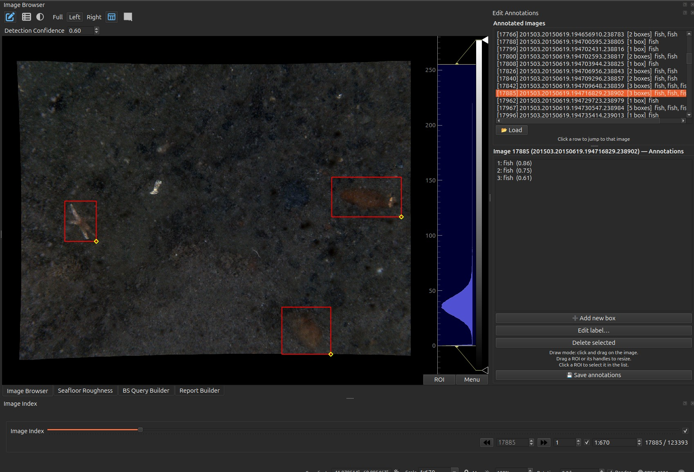

# Image & Video Annotation

Create and curate labelled observations on both still imagery and video frames —
the optical "ground truth" that anchors the acoustic interpretation.

## Image annotation

<figure markdown>
  { width="1100" }
  <figcaption>Three detector boxes on one frame, with the editor alongside. The
  <b>Annotated Images</b> list jumps straight to any annotated frame; the panel
  below it lists this frame's labels and scores — <code>fish (0.86)</code>,
  <code>fish (0.75)</code>, <code>fish (0.61)</code>. Note the last one against
  the <b>Detection Confidence</b> of 0.60: raise the threshold by a hundredth and
  that box disappears.</figcaption>
</figure>

- Draw a **bounding box** over a feature in the current image, assign a **label**
  and a **confidence**, and save it.
- Existing annotations (e.g. from an automated detector CSV) are shown as boxes;
  select one to **edit** its label/extent or **delete** it.
- A **confidence threshold** filters which annotations are displayed (shared with
  the [Image Browser](image-browser.md)).
- Known labels are remembered to keep labelling consistent across images.

**How to use:** enter *Add* (draw) mode, drag a box on the image, pick/enter a
label and confidence in the editor panel, and save. Click an existing box to
re-select it for editing or deletion.

## Video annotation

<figure markdown>
  <!-- TODO: replace src with assets/img/annotation-video-1.png -->
  { width="900" }
  <figcaption>Per-frame annotations in the Video Player.</figcaption>
</figure>

- Annotations are attached **per frame**: add / edit / delete boxes on the frame
  currently shown in the [Video Player](video-player.md).
- Each annotation carries a label and confidence, mirroring the image workflow.

!!! tip "Annotation data"
    Image annotations come from / persist to the `imageannotation` CSV; video
    annotations are keyed by frame index. Both feed the same labelled-observation
    model used elsewhere in the plugin.

    The two file formats are different and are documented column by column in
    **[Annotations & video](../data-model/annotations-and-video.md)** — the image
    CSV is read *positionally* (column order matters, header names do not), the
    video CSV by header name.
