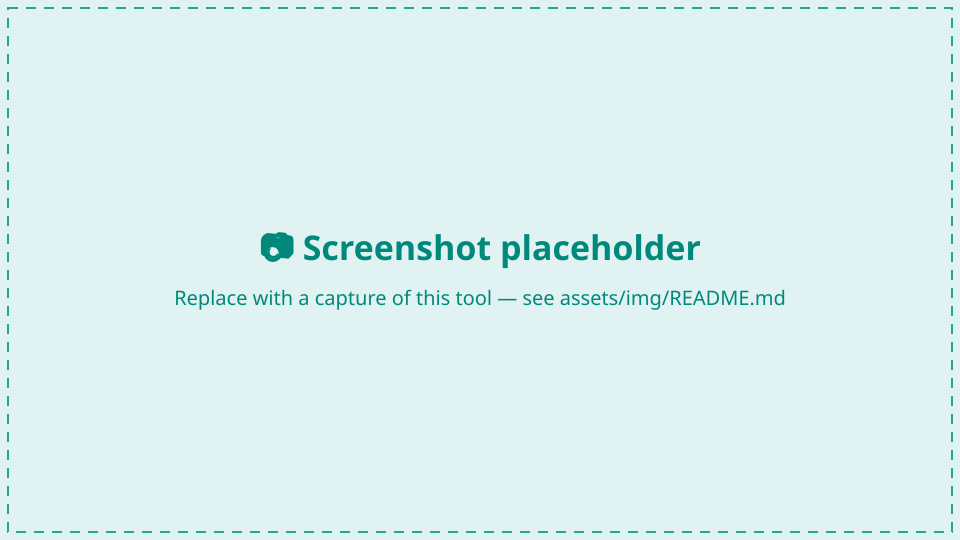

# GRASS / FastGIS toolbox

The acoustic and terrain analysis in GroundTruther is powered by a remote
**GRASS GIS** service exposed through the **FastGIS GRASS API**
(`https://api.fastgis.eu`). The toolbox lets you connect to it, manage GRASS
*environments*, set the analysis region, push data in and out, and run **any**
GRASS module — without installing GRASS locally.

<figure markdown>
  <!-- TODO: replace src with assets/img/grass-settings-1.png -->
  { width="900" }
  <figcaption>Connecting and selecting a GRASS environment.</figcaption>
</figure>

## Connect

In **Settings → Processing**, set:

- **`grass_api_endpoint`** — the API base URL (default `https://api.fastgis.eu`).
- **`grass_api_key`** — your API key (`fgk_…`), sent on every request.

## Environments

Every operation runs against an **environment** — a server-side workspace that
binds a GRASS *location* (a coordinate system) and *mapset* to your account. In
the GRASS settings dialog you can:

- **List and select** your environments (the active one is what tools act on).
- **Create** a new environment from an **EPSG code** or by uploading a
  **georeferenced dataset** (whose CRS seeds the new location — the file is also
  imported as a layer).
- **Create mapsets** within an environment.

## Computational region

GRASS modules honour the current **computational region**. You can:

- **Set the region** from a box drawn on the map (coordinates are reprojected to
  the environment's CRS automatically), or align it to a layer.
- **Show/hide the current region** on the map with the **Region** toggle — it
  outlines the active environment's region without changing it.

<figure markdown>
  <!-- TODO: replace src with assets/img/grass-region-1.png -->
  { width="900" }
  <figcaption>The current computational region rendered on the canvas.</figcaption>
</figure>

## Move data in and out

- **Import a file** into the active environment (raster or vector) from disk.
- **Send a loaded QGIS layer** to the environment: right-click it in the Layers
  panel → **Send to active GRASS environment** (it's reprojected to the
  environment's CRS on the way).
- **Add GRASS rasters to QGIS** from the layer table (button or right-click) —
  fetched as GeoTIFF and added to your project.

## Run GRASS modules

GroundTruther builds a module dialog **on the fly** from the module's own
interface description — so virtually any non-blacklisted GRASS module is usable,
not just a hard-coded few.

<figure markdown>
  <!-- TODO: replace src with assets/img/grass-module-1.png -->
  { width="900" }
  <figcaption>A dialog generated from a GRASS module's interface (here r.geomorphon).</figcaption>
</figure>

- **Pick a module:** type into the module search box and choose from the
  autocomplete over the full GRASS catalogue; the form is built from its schema.
- **Quick presets:** buttons for common seafloor modules
  (`r.geomorphon`, `r.param.scale`, …).
- **Run asynchronously:** modules run on the server with **live progress** and a
  **Cancel** option, so the UI stays responsive on large DEMs.
- **Outputs return to QGIS:** rasters created by a run are pulled back and added
  to your project automatically; stdout/stderr appear in the output panel.

!!! info "How it works under the hood"
    The plugin talks to an environment-scoped, authenticated REST API; module
    UIs are generated from each module's interface description, runs are queued
    as background tasks, and results are retrieved as GeoTIFFs. See the
    [Architecture](../architecture.md) page for the data-flow diagram.

## Settings summary

| Setting (Processing) | What it is |
|---|---|
| `grass_api_endpoint` | FastGIS API base URL. |
| `grass_api_key` | API key sent as `X-API-Key`. |
| `gpu_avaibility` | Whether a CUDA GPU is available for spatial selection acceleration. |
