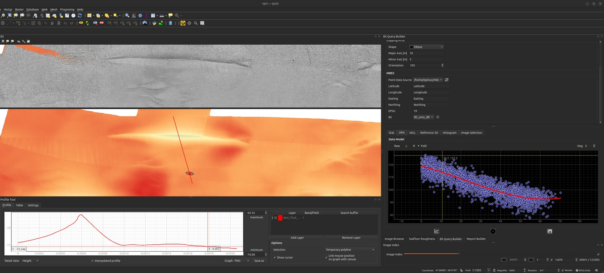
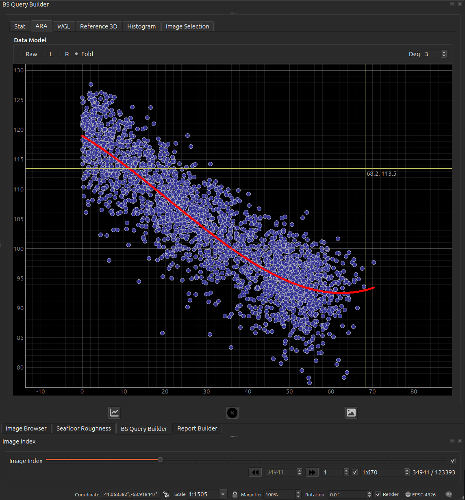
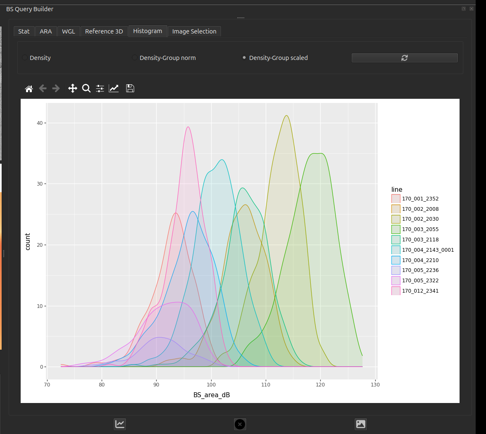

# Acoustic Query Builder

Interrogate MBES products — backscatter and bathymetric derivatives — under
points and sampling shapes, and summarise their distributions. This is where the
acoustic side of the "ground-truthing" happens.

<figure markdown>
  { width="1100" }
  <figcaption>The sampling unit defined (ellipse, 10 × 5 m, oriented 105°) over the
  backscatter and bathymetry, with the angular response of the soundings inside
  it.</figcaption>
</figure>

## What it does

- **Point query:** click the map to read the value(s) of selected GRASS raster
  layers (backscatter, slope, geomorphons, …) at that location, via the
  [GRASS/FastGIS](grass-fastgis.md) `sample` endpoint (the server reprojects your
  click as needed).
- **Spatial selection:** draw a sampling shape and select the MBES soundings that
  fall inside it. Point-in-polygon testing runs over a soundings **Parquet** table
  with a fast `numba`-accelerated routine (with an optional GPU/`cuspatial` path).
- **Distributions:** visualise the selected values (e.g. backscatter angular
  response / density) with `plotnine`/`matplotlib`, ready to compare against the
  optical evidence.

## The angular response (ARA)

The **ARA** tab is the acoustic read-out of a sampling unit: every selected
sounding plotted as **backscatter against incidence angle**, with a polynomial fit
(the **Deg** spinner sets the degree) through the cloud. The angular response curve
— high near nadir, falling and flattening toward grazing — is the shape that
carries substrate information, and it is what the
[roughness metrics](seafloor-roughness.md) are set beside.

The **Data Model** radios pick which beams contribute:

| | |
|---|---|
| **Raw** | every selected beam, port and starboard together |
| **L** / **R** | one side only — use these when the two sides disagree, which is itself diagnostic |
| **Fold** | the two sides folded onto a common \|angle\| axis, so port and starboard stack |

Sibling tabs cover the rest of the selection: **Stat** (summary statistics),
**Histogram** (value distribution), **Image Selection** (the seafloor frames that
fall inside the shape), and the two 3-D views below.

<figure markdown>
  { width="760" }
  <figcaption>The ARA tab: backscatter against incidence angle for the selected
  soundings, folded across nadir, with a degree-3 fit. The axes are unlabelled in
  the widget — x is incidence angle in degrees, y is the backscatter field named in
  the <b>BS</b> selector above (here <code>BS_area_dB</code>).</figcaption>
</figure>

The **Histogram** tab is worth singling out: it splits the selection **by survey
line**, so systematic differences between lines are visible directly.

<figure markdown>
  { width="800" }
  <figcaption>Density of <code>BS_area_dB</code> per line inside one sampling unit.
  Lines offset from one another by several dB over the same seabed is exactly the
  per-line variation that has to be normalised away before backscatter can be
  compared across a survey.</figcaption>
</figure>

## The 3-D surface

Two tabs show the selected area in 3-D, and **they are not the same product** —
read this before putting either in a report.

| tab | where the surface comes from |
|---|---|
| **WGL** | The **selected soundings**, gridded on the fly. Always available. |
| **Reference 3D** | The `reference_surface` GeoTIFF, clipped to the sampling shape. Only when that setting points at a readable, north-up raster. |

!!! warning "WGL needs a large selection to mean anything"
    The soundings grid is built at a fixed **1.5 nodes per metre across the
    selection's bounding box**, so its resolution is set by how big your selection
    is, not by how dense the pings are:

    | selection extent | grid |
    |---|---|
    | 250 m | 375 × 375 — a real surface |
    | 25 m | 37 × 37 |
    | 5 m | 7 × 7 — barely a surface |
    | 2 m | 3 × 3 — meaningless |
    | under ~0.7 m | **empty** |

    A sampling unit sized for ground-truthing — metres across — therefore produces
    a handful of nodes, and reading relief off it is not justified. **Use WGL for a
    broad survey-scale selection; for a sampling unit, read the acoustics from the
    [ARA tab](#the-angular-response-ara) and the relief from Reference 3D**, which
    is clipped from the bathymetry raster and keeps its own resolution regardless
    of how small the shape is.

!!! warning "Both surfaces fill space that has no data"
    Neither tab distinguishes *measured* seabed from *inferred* seabed. The
    filling is different in each, and in both cases it looks like real relief:

    - **WGL** grids the soundings with **nearest-neighbour** interpolation over the
      full **bounding box** of your selection. Nearest-neighbour has no concept of
      a data boundary, so the corners of the box — outside the sampling shape, and
      possibly far from any ping — are filled with the value of the closest
      sounding. The result is a complete rectangle of "surface" whose edges may be
      pure extrapolation. The grid is built at a fixed **1.5 nodes per metre**
      regardless of actual sounding density, so where the data is sparser than that
      the surface is visibly blocky — those flat tiles are one sounding each, not
      resolved seabed.
    - **Reference 3D** replaces every **NoData** cell in the clipped window with the
      **median height of that window**. A gap in the bathymetry therefore appears as
      a smooth plate at typical depth, not as a hole.

    Read a wide, featureless area in either tab as *"no information here"* rather
    than *"flat seabed here"*. Cross-check against the raster itself in the map
    canvas if it matters.

### Reading it quantitatively

The **Reference 3D** tab is the one built for measurement:

- A live **cursor read-out** of Easting / Northing / Elevation, **snapped to the
  nearest grid sample** so the number is a real cell value rather than an
  interpolated guess at the pointer.
- **Click to drop a marker**, and a two-point **measure** tool reporting 3-D
  distance with its horizontal and vertical components.
- A **vertical-exaggeration** slider, **1× … 20×, defaulting to 1×**. Picking and
  measuring read the true elevation and are unaffected by it — but everything you
  *see* above 1× overstates the relief. Note the VE whenever you show a screenshot.

The **WGL** tab has none of these: it is a plain surface for orientation, with no
read-out, no picking and no exaggeration control.

### Resolution and CRS caveats

- The clipped reference surface is **downsampled so its longer side is at most 300
  cells**. A large sampling shape is therefore shown much coarser than the source
  raster — the 3-D view is a preview of the DEM, never a substitute for it.
- Only **north-up** GeoTIFFs are supported. A rotated raster — such as a
  georeferenced micro-DEM or mosaic from the
  [Seafloor Roughness](seafloor-roughness.md) tool — is rejected, and the tab
  falls back to the soundings surface.
- If the raster is **geographic** (degrees), the horizontal axes are converted to
  local metres by an **equirectangular approximation** about the window centre, so
  that the vertical and horizontal units match. Over a sampling-shape-sized window
  the error is negligible; it is still an approximation, not a reprojection.
- Any failure to clip — missing file, wrong CRS, no overlap, all-NoData — is
  **logged to the `GroundTruther` message-log tab** and the tab silently falls back
  to the soundings surface. If you expected the GeoTIFF, check the log rather than
  assuming you are looking at it.

!!! note "Which surface ends up in the report"
    [Report Builder](report-builder.md) captures the **Reference 3D** tab when it is
    showing a surface, and the **WGL** soundings surface otherwise. The exported
    image is not labelled with its source, so state in your report text which one
    it is — and at what vertical exaggeration.

## How to use

1. In the GRASS toolbox, **select an environment** and choose which raster layers
   to query.
2. Use the **point-query** map tool to read values at a click, or draw a
   **sampling shape** to select soundings within it.
3. Review the returned values / plots; results can feed into the
   [Report Builder](report-builder.md).

## Inputs (Settings → Mbes)

| Setting | What it is |
|---|---|
| `soundings` | MBES soundings table (Parquet) used for spatial selection. |
| `reference_surface` | *Optional* GeoTIFF DEM. When set, the 3-D viewer clips **this raster** to the sampling shape instead of gridding the selected soundings; it falls back to the soundings surface if the file is missing or unreadable. |

Column-by-column — including how the backscatter field is chosen and what the
port/starboard/fold beam filter does:
**[MBES soundings](../data-model/mbes-soundings.md)**.

GRASS raster layers (backscatter, derivatives) live in the active GRASS
environment — see the [GRASS / FastGIS toolbox](grass-fastgis.md).

!!! tip "Column names are configurable"
    Easting, Northing, Longitude and Latitude are read from **editable text
    fields** in the query builder, so a table using different names works without
    any code change. If one of the four is missing, the spatial tools stay
    disabled and the missing names are logged to the `GroundTruther` message-log
    tab.
