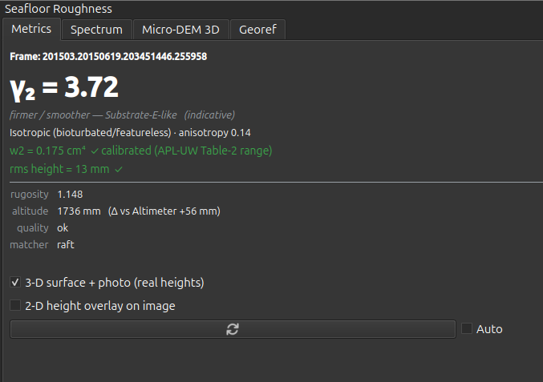
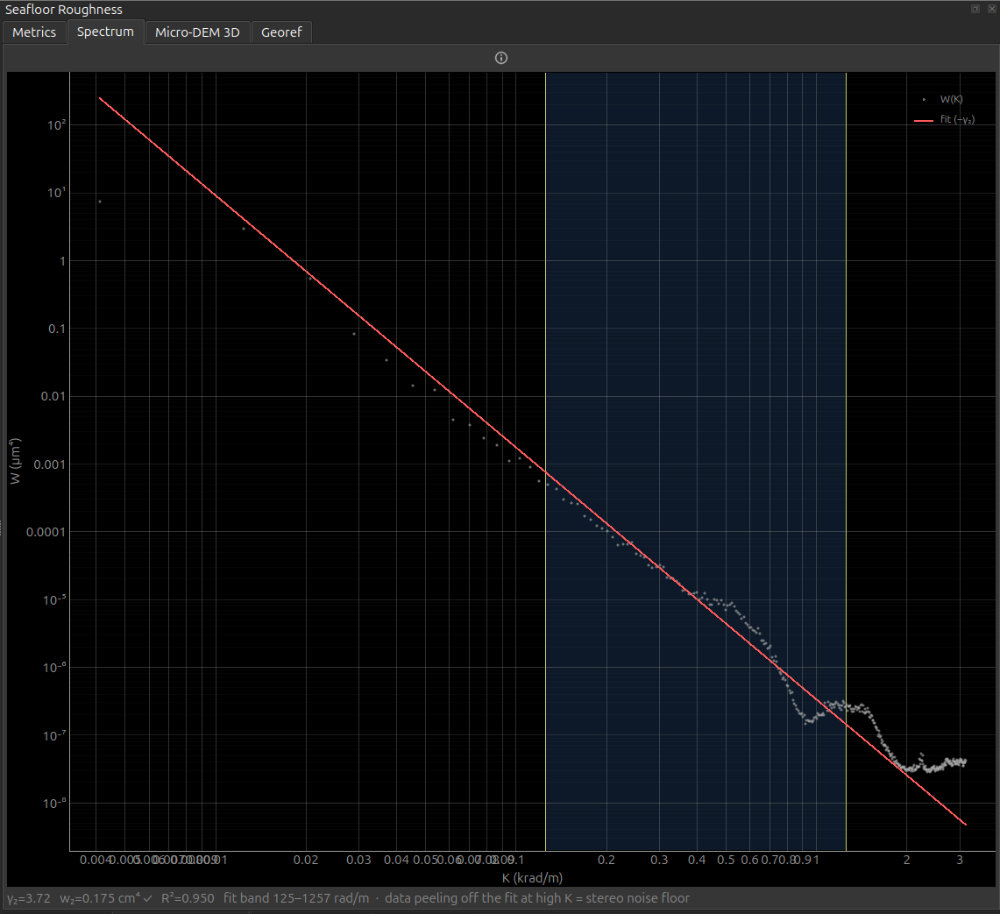
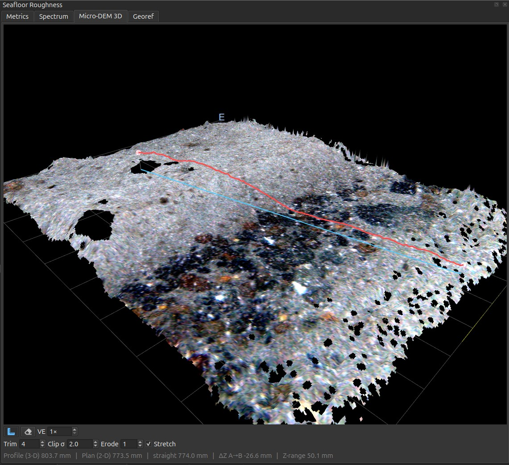

# Seafloor Roughness

Measure the **physical roughness of the seabed** in the current HabCam frame —
from the stereo imagery itself, independently of the acoustics. It gives you a
quantitative texture descriptor to set beside the backscatter, plus a real-height
micro-DEM of the patch the camera is looking at.

<figure markdown>
  { width="677" }
  <figcaption>The Metrics tab for one HabCam frame. γ₂ leads because it is the
  trustworthy output; below it the indicative substrate and texture lines, then
  w₂ and rms height carrying the service's per-frame trust flag — green here,
  which is the good case rather than the usual one.</figcaption>
</figure>

Open it with the **cubes** icon on the GroundTruther toolbar; it docks on the
right and follows whichever frame the [Image Browser](image-browser.md) is on.

## How it works

Roughness is computed **server-side**. GroundTruther sends only the current
frame's identifier — its `Imagename`, e.g.
`201503.20150619.181140656.204627` — and the service reads the stereo pair from
its own archive, runs stereo matching (RAFT-Stereo on a GPU), and returns the
metrics plus whatever optional rasters you asked for. No image bytes leave your
machine.

Two transports, same request and response:

- **Through FastGIS** (the normal case) — `POST /seafloor/roughness` with your
  `X-API-Key`. It reuses the GRASS credentials, so if the
  [GRASS toolbox](grass-fastgis.md) works, roughness works.
- **Direct** — set `Roughness.direct_url` to POST straight at the GPU service
  with no auth. Only useful when QGIS is running on the GPU host itself.

Configure both in
[Settings → Seafloor roughness](../configuration/settings-reference.md#roughness).
If neither the FastGIS credentials nor a direct URL are set, the panel says
*"roughness service not configured"* and does nothing else.

!!! tip "First call is slow"
    The GPU model loads lazily — expect ~14 s for the first frame of a session
    and ~0.5 s afterwards. Requests run as background QGIS tasks, so the UI stays
    responsive, and results are cached per frame so revisiting a frame is
    instant.

## Metrics tab

Press **Compute roughness**, or tick **Auto** to recompute every time you browse
to a new frame.

| Read-out | What it is |
|---|---|
| **γ₂** *(the big number)* | The **spectral exponent** — the slope of the relief power spectrum. This is the load-bearing output: it describes the texture/fractal character of the surface, it is robust across stereo matchers, and it is the metric this tool adds on top of backscatter. |
| Substrate line | An *indicative* read off γ₂ and rugosity — "fine / bioturbated", "firmer / smoother", or "intermediate". It is a hint, not a classification. |
| Texture line | Ripples vs bioturbation for this frame, from the spectrum's anisotropy, dominant orientation and wavelength. |
| **w2** | Spectral strength, reported in cm⁴ (APL-UW/Jackson convention). **Colour-coded per frame** by the service's own trust flag. |
| **rms height** | RMS relief in mm. Same per-frame trust gate as w2. |
| rugosity | Surface-area ratio. |
| altitude | The service's altitude estimate — cross-check it against the frame's `Altimeter` metadata; they should agree to a few centimetres. |
| quality | `ok`, `insufficient_coverage`, or `spectrum_fit_failed`. |
| matcher | `raft`, `sgbm`, or `sgbm(fallback)`. |

!!! warning "Trust γ₂; do not trust w₂'s absolute value"
    When `quality` is not `ok`, **every** roughness field is null — the panel
    shows that rather than fabricating a number.

    Even when it *is* `ok`, the absolute amplitude of w₂ is not reliable from
    current stereo: a RAFT-vs-SGBM comparison found no consistent bias between
    matchers. The panel colours w₂ and rms height green only when the service
    flags that frame as physically plausible with a clean fit — which is rarely.
    Use γ₂, rugosity, anisotropy and *relative* rms height as your physical
    features; do not feed w₂'s absolute value into a physical inversion.

Two checkboxes control how much work the service does — request only what you
will actually look at:

- **3-D surface + photo (real heights)** — fetches the real-height micro-DEM grid
  and the co-registered orthophoto, so the Micro-DEM 3D tab can show a
  photo-textured surface. Slower.
- **2-D height overlay on image** — fetches the per-pixel height raster and the
  rectified-left preview and drapes them on the displayed image. Slower.

## Spectrum tab

The radial relief power spectrum on log-log axes: **W (m⁴) against K (rad/m)**,
with the fitted power law overlaid as a straight line of slope −γ₂, the fit band
shaded, and γ₂ / w₂ / R² annotated.

This is the diagnostic that tells you whether to believe the number on the
Metrics tab:

- Where the measured curve **peels away from the fit line at high K**, you are
  seeing the stereo noise floor, not the seabed.
- A **flat or clearly anisotropic** spectrum flags ripples — the radial average
  assumes isotropy, so γ₂ means less there.

The spectrum is always requested; it is a small payload.

<figure markdown>
  { width="800" }
  <figcaption>The same frame's spectrum: W (µm⁴) against K (krad/m) on log-log
  axes, the fitted power law in red and the fit band shaded. The read-out is
  <code>γ₂=3.72 · w₂=0.175 cm⁴ ✓ · R²=0.950 · fit band 125–1257 rad/m</code>, and
  above ~1 krad/m the measured curve flattens away from the fit — that tail is the
  stereo noise floor, not the seabed.</figcaption>
</figure>

## How well does this actually work?

Roughness from this stereo has been tested against an independent label set on the
HRS1508 survey — 217 cells of a 25 m grid with single-substrate ground truth,
random forest, five-fold cross-validation on **200 m spatial blocks** (not random
folds, which would leak geography between train and test).

| model | accuracy |
|---|---|
| backscatter angular response alone | 0.659 |
| + γ₂ | 0.691 |
| + γ₂ and rugosity | 0.714 |
| **+ all roughness features** | **0.756** |

The gain of **+0.097** has a 95 % confidence interval of 0.039–0.155 and a
block-permutation *p* < 0.001, and **γ₂ ranked first of all ten features** — above
every backscatter descriptor. Minority-class recall went from 0.43 to 0.60. So the
headline claim on this page — that γ₂ carries real substrate information that
backscatter does not — is measured, not asserted.

Three limits came out of the same work, and they matter when you use this tool:

!!! warning "`insufficient_coverage` is not a random failure"
    Frames rejected by the coverage gate are **biased by substrate**. On HRS1508,
    2.7 % of cells over one substrate were rejected against **12.9 %** over
    another — a Fisher odds ratio of **5.3** (*p* ≈ 2×10⁻²⁵). Turbidity over fine
    sediment is what drives it. Consequently the frames you *successfully* measure
    are not a representative sample of the seabed you flew over, and coverage maps
    built from roughness will under-represent exactly the softest ground. Report
    the rejection rate per class, don't just drop the failures.

- **w₂ and rms height were excluded from that analysis entirely** — not
  de-weighted, excluded. Amplitude is not recoverable from this stereo, which is
  the same conclusion the per-frame trust flag reaches one frame at a time.
- **Rugosity is amplitude-derived like w₂, yet it ranks third.** It is a
  useful discriminator here; treat it as an empirical feature rather than a
  calibrated physical quantity.

Per-frame health on a 296-frame line, for comparison with your own data: 2.0 %
rejected (all `insufficient_coverage`), service altitude agreeing with the
metadata `Altimeter` to a **median 37 mm**, and γ₂ median 2.97 (IQR 2.66–3.15).

## Micro-DEM 3D tab

The real-height micro-DEM as an interactive 3-D mesh, draped with the orthophoto
as a 1:1 texture (one texel per vertex) when the surface outputs were requested.
Heights are in millimetres and sit near −altitude, so the mesh is a true
representation of the patch under the camera, not a high-passed roughness field.

<figure markdown>
  { width="800" }
  <figcaption>The same frame again, as a photo-textured mesh, with a two-point
  measurement across the patch: <code>Profile (3-D) 803.7 mm · Plan (2-D) 773.5 mm
  · ΔZ A→B −26.6 mm · Z-range 50.1 mm</code> — the 3-D distance exceeds the plan
  distance by 30 mm, which is the relief. The black patches are no-data cells culled
  by <b>Trim 4 / Clip σ 2.0 / Erode 1</b>, not flat seabed, and <b>Stretch</b> is on.
  </figcaption>
</figure>

!!! note "The cell size is the service's choice, not yours"
    `Roughness.res_mm` is a **request**. The service picks the grid spacing per
    frame and reports what it used as `dx_mm`. The nominal default is 1 mm and some
    frames do return it, but across one line of the reference dataset **2, 3, 4 and
    5 mm all appear**. So a micro-DEM's resolution is a property of that frame, not
    of your settings: two frames' grids are not necessarily comparable cell-for-cell,
    and anything that combines frames has to resample each through its own
    geotransform. Read `dx_mm` rather than assuming.

The stereo DEM is unreliable at the grid border and around no-data holes, which
otherwise shows up as spikes draped in stretched texture. Three live controls
mask them; their starting values come from
[`Roughness.dem_trim_border` / `dem_clip_sigma` / `dem_erode`](../configuration/settings-reference.md#3-d-mesh-edge-spike-mitigation):

- **Trim border** — drop N outer rings of the grid.
- **Clip σ** — reject cells more than N robust sigmas from the median height.
- **Erode** — peel N rings off every no-data / outlier boundary.

Masked cells are flattened to the median and made transparent in the texture.

## Georeferencing (Georef tab)

Tick **Georeference** and GroundTruther attaches the frame's navigation to the
request. The service returns a geotransform, and the plugin writes the outputs as
GeoTIFFs and adds them to your project:

| Output | Raster |
|---|---|
| Micro-DEM | 1-band Float32, heights in mm, NaN no-data |
| Orthophoto | 3-band RGB |
| Mosaic | 3-band RGB, or 4-band RGBA with **Transparent border** ticked |

Both land in your survey CRS, so they overlay the bathymetry and backscatter
directly.

!!! info "QGIS redraws rotated rasters north-up"
    The geotransform is a **rotated** affine — the grid is aligned to the
    vehicle's heading, not to north. QGIS's GDAL provider warps such a raster to
    north-up for display, which makes it report a larger bounding box and add an
    alpha band. That is expected: the file on disk and its georeferencing are
    correct.

### The position that is used

Georeferencing uses the **calibrated USBL fix** — `Xutm + dx`, `Yutm + dy` — the
same position as the red map marker and the query builder's sampling centre, so
the raster, the marker and the sample all coincide. It is *not* the ship GPS and
*not* the layback model. See
[Image metadata → Positioning](../data-model/image-metadata.md#positioning-read-this-first).

### Heading offset vs Mirror

These two controls fix different things and are not interchangeable.

| Control | What it is | Symptom that calls for it |
|---|---|---|
| **Heading offset** | A **continuous rotation** in degrees, added to the navigation heading before the server computes the geotransform. | Rasters are consistently **rotated** relative to the bathymetry — features line up in shape but sit at an angle, and the error is the same angle on every frame. |
| **Mirror** | A **discrete handedness flip** — a reflection of the port/starboard axis. | A mosaic comes out **port/starboard-flipped**: features are mirror images of the real seabed, and successive frames lay down in the wrong lateral order. |

The distinction matters because **no rotation can undo a reflection.** If the
imagery is mirrored, turning the heading offset will move the error around the
compass but never remove it — you will chase it forever. Ask: does the picture
look *rotated*, or does it look *flipped*? Rotated → heading offset. Flipped →
Mirror, once.

The mount is known (image bottom→top = heading, image-right = starboard), so the
defaults — offset `0`, mirror off — are correct out of the box for the reference
deployment. Treat both as escape hatches.

!!! warning "A saved heading offset near ±180 was resetting a real bug"
    Until [#31](https://github.com/epifanio/groundtruther/issues/31) GroundTruther
    sent the nav's `bearing` column as the heading. `bearing` points **astern**, so
    every georeferenced product came out **rotated 180°** — and a heading offset of
    ±180 was the natural way to paper over it.

    The derivation is now correct (see
    [`Heading` vs `bearing`](../data-model/image-metadata.md#positioning-columns)),
    which means such an offset would double-correct. So the **first time you open a
    dataset whose calibration was saved before the fix, its `heading_offset_deg` is
    reset to the config default** and a line saying so appears in the
    `GroundTruther` message log. `epsg`, `mirror` and `georeference` are untouched.
    If you had dialled in a genuine mount fine-tune, set it again and save.

    Rasters exported before the fix are rotated 180° and need regenerating.

### Saved calibration overrides the config

!!! warning "Why editing Settings appears to do nothing"
    **Save calibration** stores `georeference`, `epsg`, `heading_offset_deg` and
    `mirror` in `QgsSettings`, keyed by a hash of your **image-metadata file
    path** — i.e. per dataset. Once a dataset has a saved calibration, **that
    wins**, and the `Roughness.*` values in `config.yaml` are only the fallback
    for datasets which have none.

    So if you edit those four keys in Settings and see no change, it is because
    this dataset is already calibrated. Change them on **this tab** instead.

    The other nine `Roughness.*` keys — service, route, direct URL, resolution,
    n-water, DEM size and the three mesh-mitigation knobs — are **not** part of
    the saved calibration and always come from the config.

Changing any of the four re-requests the current frame immediately, so you can
see the effect straight away. **Clear georef layers** removes the rasters this
panel added to the project.

## Mosaic

The Georef tab also builds a **georeferenced mosaic** of the frames around the
current one: pick a **window** (± N contiguous frames), a **mode**, and press
**Build mosaic**. The service pulls the navigation for the window itself and
skips frames whose image is missing from its archive.

| Mode | How frames are placed |
|---|---|
| **Auto** *(default)* | Chooses per window from the nav-predicted overlap: piled-up frames with plenty of shared content → *pixel*; well-spread frames → *flat*. |
| **Flat** | By navigation alone (position, heading, flat-seabed scale). Fast; best when the nav is accurate. |
| **Ortho** | Relief-corrected per-frame orthophoto, then nav placement. Slowest. |
| **Pixel** | Registered by **image content**, georeferenced through the reference frame's nav. Use when the nav is too coarse and frames pile up. |

Two presets set the rest for you: **Browse** (3 mm, anti-aliased, fast overview)
and **Publication** (ortho, 0.8 mm, lanczos, 8192 px, RGBA).

!!! note "When the mosaic is nav-placed anyway"
    Featureless seabed — smooth mud with no clasts — cannot be content-registered
    by any method. In *pixel* and *auto* modes the service reports how many frame
    pairs it actually registered by content, and GroundTruther shows a banner
    when that fraction is low ("only 0/10 pairs registered — low texture, mosaic
    is nav-placed"). That is a limit of the data, not a fault: read the mosaic as
    nav-accurate, not pixel-accurate, in those stretches.

**Illumination correct** (flat-fields the strobe vignette and equalises
brightness) and **Gain compensate** are on by default and are what make a mosaic
look continuous. Turn illumination correction **off** for absolute-radiometry
work — it deliberately normalises radiometry.

## Settings summary

| Setting | What it is |
|---|---|
| `Processing.grass_api_endpoint`, `Processing.grass_api_key` | The credentials roughness reuses. |
| `Roughness.base_url`, `Roughness.route`, `Roughness.direct_url` | Override the transport. Empty = reuse FastGIS. |
| `Roughness.res_mm`, `Roughness.n_water`, `Roughness.dem_max_side` | Compute knobs. Leave the first two unset. |
| `Roughness.georeference`, `epsg`, `heading_offset_deg`, `mirror` | Georeferencing defaults — **overridden by a saved per-dataset calibration**. |
| `Roughness.dem_trim_border`, `dem_clip_sigma`, `dem_erode` | Starting values for the 3-D mesh mitigation controls. |

Full descriptions in the
[settings reference](../configuration/settings-reference.md#roughness).
